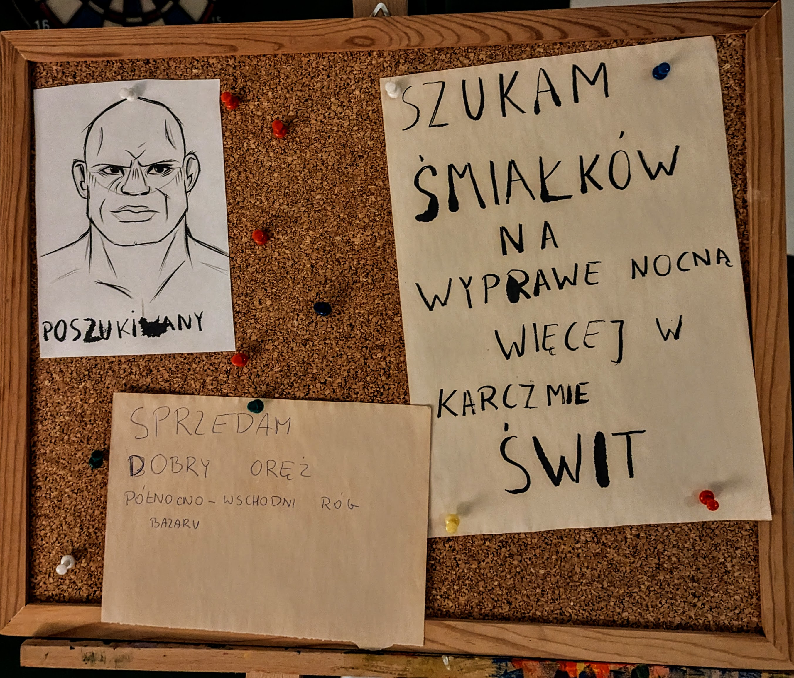

## W skrócie
Opuszczamy wioskę Mohac i docieramy do skrzyżowania przed Snitin, gdzie Druna i Arameia wyruszają na rekonesans. Na rynku spotykają Askala, bogatego kupca sprzedającego magiczne przedmioty, i dowiadują się o przeklętej kobiecie imieniem Christina. Strażnicy informują, że droga do Killrock jest zablokowana przez wyciek mikstur z wozu alchemiczki. Grupa udaje się do karczmy Świt, gdzie znajdujemy Tilmana- łowcę potworów który chce upolować Naktinisa. Po zaczajeniu się na niego i uwięzieniu go w magicznej klatce, pojawiają się członkowie plemienia Aludra, którzy wyganiają nas. Wracamy do karczmy i gramy w "Prawda i piwo lub odmowa i ocet"

## Recap ostatniej sesji
Podróżujemy dalej do Killrock. Po drodze spotykamy handlarza kamieniem oraz rodzinę, która zachorowała przez nieznany nam totalnie powód (operacja SRAKA). Dojeżdżamy do małej wioski Mohac gdzie jesteśmy przyjęci przez Falnora i jego babkę Nisyrę.
## Log
Opuszczamy wioskę [Mohac](../lokacje/Mohac.md) wczesnym rankiem. Jedziemy dalej w stronę [Snitin](../lokacje/Snitin.md). Na polach rolnicy pracują intensywnie, mijają nas wozy kupieckie pełne worków z żytem i ziarnami. W naszą stronę jedzie z zawrotną prędkością wielki biały wóz. Powozi nim osoba w brązowych szatach i białym fartuchu. Krzyczy na nas żebyśmy się przesunęli z drogi. Na boku wozu namalowany jest kaduceusz - laska z jednym wężem oplecionym wokół. Najprawdopodobniej pomoc medyczna.

Dojeżdżamy do wielkiej polany na której wybudowane jest miasteczko. Przed nim ubita polna droga zamienia się w brukowaną i rozwidla się w czterokierunkowe skrzyżowanie. 
###### ↑ [Snitin](../lokacje/Snitin.md)
###### → [Vilden](../lokacje/Vilden.md)
###### ↓ [Perestrand](../lokacje/Perestrand.md)
###### ←[Winwaard](../lokacje/Winwaard.md)

Z obawy przed straszeniem zwierząt w całym miasteczku, [Ashtar](../postacie%20graczy/Ashtar.md), [Solaris](../postacie%20graczy/Solaris.md) i [Zaufanie](../postacie%20graczy/Zaufanie.md) zostają przy wozach a [Arameia](../postacie%20graczy/Arameia.md) i [Druna](../postacie%20graczy/Druna.md) wyruszają do miasta żeby zrobić rekonesans. Przy drogowskazie coś porusza się w krzakach. Po szybkiej inwestygacji w krzaku siedzi grupka dzieci i się w coś bawią.  [Druna](../postacie%20graczy/Druna.md) rzuca w jedno z nich kamieniem. Wchodzą do [Snitin](../lokacje/Snitin.md). Po [Snitin](../lokacje/Snitin.md) poza mieszkańcami poruszają się patrole chłopów ubranych w skórznie. Tutejsza milicja. 

Na środku [Snitin](../lokacje/Snitin.md) znajduje się rynek na którym codziennie otwierany jest bazar. Druna wypatruje kobietę, która szaleńczo biegnie w stronę centrum. Idą za nią i trafiają na wielkie zbiegowisko wokół wozu. Jest on bogato zdobiony ze złotymi elementami i brokatowym dachem. Na wozie stoi młody mężczyzna ze złotymi włosami ubrany w bogato zdobione szaty. Robi show, tłum zacieśnia się wokół wozu. Kobieta dołącza do tłumu i znika [Drunie](../postacie%20graczy/Druna.md) i [Aramei](../postacie%20graczy/Arameia.md) z oczu. Mężczyzna przedstawia się jako [Askal- Wielki Kupiec](../NPC/Askal-%20Wielki%20Kupiec.md). Oferuje przeróżne rzeczy, piękności, magiczne amulety. Fajerwerki wystrzeliwują z boków wozu, tłum błyskawicznie ustawia się w kolejkę do wozu, która ciągnie się przez cały rynek. 

[Snitin](../lokacje/Snitin.md) czci [Nelene](../bogowie/Nelene.md).

[Druna](../postacie%20graczy/Druna.md) i [Arameia](../postacie%20graczy/Arameia.md) zaczepiają starszą panią, która ustawia się za nimi w kolejce. Okłamują ją na temat tego co robią w mieście itd. Starsza pani opowiada im o [Christinie](../NPC/Christina.md)- szalonej kobiecie mieszkającej w mieście. Wspomina o klątwie ciążącej na całej jej rodzinie, twierdzi, że to jakiś pomiot szatana itd. Kiedyś podobno biegała na obrzeżach miasta nago a pioruny waliły po niej i nic się jej nie działo. Dziewczyny zmywają się z rynku, idą rozmawiać z milicją.

Na ten moment droga do [Killrock](../lokacje/Killrock.md) jest zablokowana. Wóz [alchemiczki Sophii](../NPC/Alchemiczka%20Sophia.md) wpadł w dziurę i rozlały się różne mikstury i przejazd jest niemożliwy, dopóki straże nie sprzątną rozlanych chemikaliów. W między czasie strażnicy [Claus](../NPC/Claus.md) i [Denis](../NPC/Denis.md) sugerują nam odpoczynek w jednej z dwóch tawern w miasteczku: 
- [Świt](../lokacje/%C5%9Awit.md)- karczma znajdująca się na wschodzie
- [Zmierzch](../lokacje/Zmierzch.md)- karczma znajdująca się na zachodzie
Polecają nam piwo Żytnie Równinne. [Druna](../postacie%20graczy/Druna.md) i [Arameia](../postacie%20graczy/Arameia.md) żegnają się z nimi i zmierzają do wozów. Znajdują dużą tablicę ogłoszeń, gdzie czerwony drakon z mieczem i toporem wystającym z jego sakwy na plecach przybija ogłoszenie
### Tablica ogłoszeń

[Druna](../postacie%20graczy/Druna.md) i [Arameia](../postacie%20graczy/Arameia.md) wracają do reszty grupy, [Solaris](../postacie%20graczy/Solaris.md) w między czasie zrobiła wianki dla wszystkich ([Ashtar](../postacie%20graczy/Ashtar.md) nie chciał :c). Ruszamy do karczmy [Świt](../lokacje/%C5%9Awit.md).

Karczma [Świt](../lokacje/%C5%9Awit.md)- duży trzypiętrowy budynek zbudowany z szarego kamienia z drewnianym szkieletem. Dach wyłożony żółtymi dachówkami. Nad drewnianymi drzwiami widnieje symbol wschodzącego słońca. 
Koło karczmy stoi stajnia do której zaprowadzamy nasze konie, gęś i wozy. Obsługuje nas rudy piegowaty chłopiec w roboczych ubraniach. Jest bardzo uprzejmy. Przedstawia się jako [Erwin](../NPC/Erwin.md). Jego ojciec [Antonin Weiser](../NPC/Antonin%20Weiser.md) jest właścicielem stajni ale siedzi w karczmie i musimy u niego opłacić postój. Solaris dała [Erwinowi](../NPC/Erwin.md) złotą monetę z obietnicą, że dostanie kolejną jak nikt nie dotknie naszych wozów, wziął zadanie na poważnie. 
W karczmie niewiele ludzi, wielki stół barmański. Za stołem stoi duży gruby łysy barman z nierówno przyciętym, rudym zarostem i niebieskimi oczami. Ma koszule ubrudzoną piwem i na niej brązową kamizelkę

> Shrek

Po lewej stronie od stołu barowego jest podest- scena. Na drugim piętrze znajdują się okrągłe stoliki a na trzecim pokoje gościnne. 

Barman to [Antonin Weiser](../NPC/Antonin%20Weiser.md). Opłacamy pobyt koni oraz nasz na jeden dzień oraz pytamy o ogłoszenie z tablicy ogłoszeń. Rozwiesił je [Tilman](../NPC/Tilman.md). Uważany ogólnie za głupca i szaleńca.
[Askal](../NPC/Askal-%20Wielki%20Kupiec.md) to ciekawa persona i bogacz, nie wiadomo jak się wzbogacił, ale na pewno wprowadza trochę życia w miasto.

[Ashtar](../postacie%20graczy/Ashtar.md) przedstawia nam swoją cegłę, nazywa się [Marcel](../NPC/Marcel.md). Mówi również, że ostatnio dobre piwo pił w Feywindzie. 

Panowie piją szybkie kilka piw, [Arameia](../postacie%20graczy/Arameia.md), [Druna](../postacie%20graczy/Druna.md) i [Solaris](../postacie%20graczy/Solaris.md) idą na bazarek w poszukiwaniu sprzedawcy orężu. Znajdujemy czerwonego drakona w północno-wschodnim rogu bazaru. Ubrany jest w przewiewne ubrania i płaszcz, żółte oczy. Na straganie prezentuje różny oręż, drzewce itd. Ma żonę. Nie jest najpewniejszym kupcem. Jego zakład w [Killrock](../lokacje/Killrock.md) upadł, nikt nie chce kupować orężu tam, więc szuka szczęścia w [Snitin](../lokacje/Snitin.md). [Arameia](../postacie%20graczy/Arameia.md) kupuje sztylet. Wspominamy mu, że ruszamy do [Killrock](../lokacje/Killrock.md), pyta się czy może się zabrać z nami w zamian za zniżkę na oręż. Drakon ma na imie [Igniros](../NPC/Igniros.md).

Kupujemy:
- nowego konia- nazywa się [Bonsai](../zwierz%C4%85tka/Bonsai.md).
- diamenty do Revivify
- [Zaufanie](../postacie%20graczy/Zaufanie.md) kupuje wędkę

Wracamy do [Świtu](../lokacje/%C5%9Awit.md). [Solaris](../postacie%20graczy/Solaris.md) próbuje się dowiedzieć kim jest [mężczyzna z ogłoszenia](../NPC/Poszukiwany%20go%C5%9B%C4%87.md). Nikt nie wie. Ogłoszenie pojawiło się kilka tygodni temu, nie ma żadnych informacji. Kupujemy piwo i próbujemy znaleźć [Tilmana](../NPC/Tilman.md). 
Na pierwszym piętrze przy stole siedzi pół-ork z czarną czupryną. Jego ciało pokrywają różowawe blizny. Na sobie ma skórzany kaftan, nie jest uzbrojony, ale za krzesłem oparta o ścianę jest bardzo skomplikowanie wyglądająca kusza. 
[Tilman](../NPC/Tilman.md) chce upolować [Naktinisa](../Potwory/Naktinis%20Maditojas.md), żaby zemścić się za wszystkich który zginęli, zarobić i uzyskać sławę. Jest wielkim łowcą potworów i chce upolować KAŻDĄ bestię. Poza [Naktinisem](../Potwory/Naktinis%20Maditojas.md) wspomina również o [Ptaku Gromu](../Potwory/Ptak%20Gromu.md) w [Punkcie Burzy](../lokacje/Punkt%20Burzy.md). Jego plan: zabrać martwą świnię na pole i zwabić nią [Naktinisa](../Potwory/Naktinis%20Maditojas.md) i go zabić.

[Naktinisy](../Potwory/Naktinis%20Maditojas.md) według legend zostały stworzone przez [Mavę](../bogowie/Mava.md) jeszcze przed [Bitwą Świateł](Bitwa%20%C5%9Awiate%C5%82.md). Ich zadaniem było polowanie na wyznawców [Mentii](../bogowie/Mentia.md). 

Świnia została położona na małej polanie, przez bardzo długi czas czekaliśmy aż w końcu pojawił się 8-nożny stwór wielkości tygrysa pokryty czarną sierścią. Miał dwa kocie ogony. Jego pysk wyglądał jak połączenie lisa i pantery a z zielonych oczu bije magia.
##### ⚔ [Naktinisa](../Potwory/Naktinis%20Maditojas.md)
Walka była trudna. Po każdym wykonanym ataku Naktinis stawał się niewidzialny. Jest to również legendarna istota, która użyła swojej legendarnej odporności żeby uniknąć pierwszego zderzenia z klątwą. Dodatkowo widoczność utrudniały nam kłosy znajdujące się na polu. W końcu wywabiliśmy go na polanę. [Solaris](../postacie%20graczy/Solaris.md) w końcu weszła Klątwa i [Naktinisa](../Potwory/Naktinis%20Maditojas.md) nie mógł stawać się niewidzialny. [Arameia](../postacie%20graczy/Arameia.md) użyła zwoju otrzymanego od [Arcymagini Aphi](../NPC/Arcymagini%20Aphi.md) żeby utworzyć magiczną klatkę wokół bestii. Uwięziony [Naktinisa](../Potwory/Naktinis%20Maditojas.md) zaczął ryczeć. 

Z pola wyłania się ogromny, sześcionożny bizon z czterema rogami. Na grzbiecie nosi wielkie skórzane siodło na którym wiezie dwie postacie w jasnobrązowych szatach. Jedno z nich zeskakuje, kiwa nam głową. Postać ma chustę na twarzy i gogle na oczach, nie widać absolutnie żadnych cech szczególnych. W rękach miał kostur-włócznie, uderzył [Tilmana](../NPC/Tilman.md) w łeb, gość poszedł spać. Członkowie [Plemienia Aludra](../organizacje/Plemi%C4%99%20Aludra.md). [Naktinisów](../Potwory/Naktinis%20Maditojas.md) nie jest aż tak wiele. Żyją głównie dzięki niewidzialności, to je ratuje. Na odchodne gość nas ostrzega "Uważajcie na burze". Wracamy w stronę miasteczka.

>"Ja jestem za równouprawnieniem"
>"Tak? A my przeciw"

Trafiamy spowrotem do [Świtu](../lokacje/%C5%9Awit.md). Dzieje się tam wielka impreza, ludzie z góry wylewają piwo na dół, tańce, hulańce, swawole. Bierzemy piwa ze sobą do pokoju, [Ashtar](../postacie%20graczy/Ashtar.md) próbuje balansować piwo na głowie wchodząc do góry.

>"Gość sturlał się po schodach jak dziecko na sankach"

Zamykamy się w pokoju, gramy w "Prawda i piwo lub milczenie i ocet"

**[Zaufanie](../postacie%20graczy/Zaufanie.md)- jak zarobił sobie na imie?**
Jego Mentor z wojska-  Zaufanie III mu nadał imie, zmarł

**[Ashtar](../postacie%20graczy/Ashtar.md)- co z jego rodzicami?**
Zmarli, nie leżą nigdzie. Elfy składają zwłoki na łódki i podpalają je na wodzie. Zmarli podczas [Wielkiego Przewrotu](../wydarzenia/Wielki%20Przewr%C3%B3t.md)

**[Druna](../postacie%20graczy/Druna.md)-czemu wyruszyła z Pipidełka?**
Odeszła sama po tym co się stało z mamą Toma. Nikt nie wie że Druna tak naprawde jest winna za to co się stało, wywalili Matkę Toma a Tom poszedł wraz z nią.

**[Ashtar](../postacie%20graczy/Ashtar.md)- na czym polegał [Wielkiego Przewrotu](../wydarzenia/Wielki%20Przewr%C3%B3t.md)?**
40 lat temu próbowano obalić króla elfów, który się okazał agentem mrocznych elfów albinosem. Wybuchła przez to wojna domowa. Ojciec Ashtara był strażnikiem w pałacu, a matka służącą

**[Arameia](../postacie%20graczy/Arameia.md) omija pytanie o swojego Mistrza**

**[Solaris](../postacie%20graczy/Solaris.md)- czy ma kryzys wiary?**
Tak

>"Świnki morskie mają błony między kopytkami"
>"Świnki morskie to gryzonie, świnie mają racice, racice to nie kopyta"

Idziemy spać.